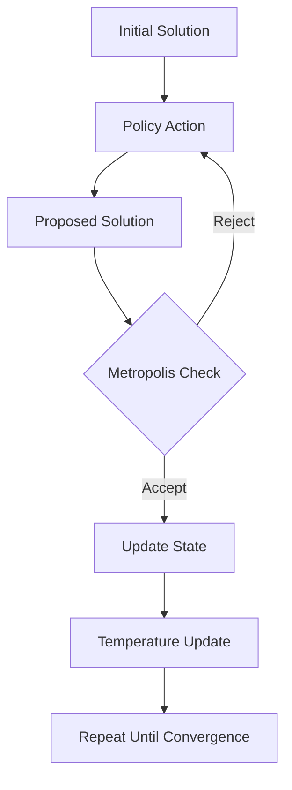

# NSA_CVRP_PPO: Neural Simulated Annealing for Capacitated Vehicle Routing with PPO

A reinforcement learning approach combining Proximal Policy Optimization (PPO) with Simulated Annealing (SA) to solve Capacitated Vehicle Routing Problems (CVRP).

## 📌 Key Features

- **Hybrid RL-Optimization**: Combines PPO with Simulated Annealing for improved exploration
- **Parallel Processing**: Handles batches of CVRP instances simultaneously
- **Flexible Heuristics**: Supports swap, 2-opt, and mixed modification operators
- **Adaptive Learning**: Implements temperature scheduling and adaptive clipping
- **Comprehensive Logging**: Integrated with Weights & Biases (wandb) for experiment tracking

## 🏗️ Project Structure
```text
NSA_CVRP_PPO/
├── README.md # Project documentation
├── requirements.txt # Python dependencies
├── launch_HP_sweep # Hyperparameter sweep launcher
├── res/ # Results directory
├── src/ # Main source code
│ ├── main.py # Training script
│ ├── HP.py # Hyperparameter management
│ ├── utils.py # Utility functions
│ ├── HyperParameters/ # Hyperparameter Configuration
│ ├── Logger.py # WandB logging utilities
│ ├── model.py # Neural network architectures
│ ├── or_tools.py # OR-Tools integration
│ ├── ppo.py # PPO implementations
│ ├── problem.py # CVRP environment
│ ├── replay.py # Experience replay buffer
│ ├── sa.py # Simulated Annealing
│ ├── scheduler.py # Temperature schedulers
│ ├── heur_init.py # Heuristics Initialisation
├── bdd/ # CVRP benchmark datasets
├── wandb/ # Model checkpoints
├── Scripts/ # Evaluation and visualization scripts
```

## 🛠️ Installation

### Prerequisites

- Python **3.8** or higher must be installed on your system, if this is the case, then run the command:
```bash
pip install uv
```

Alternatively, you can install [uv](https://docs.astral.sh/uv/getting-started/installation/) with different methods listed on the website


1. Clone the repository:
```bash
git clone https://github.com/JAndretti/Neural_Simulated_Annealing_CVRP_PPO.git
cd Neural_Simulated_Annealing_CVRP_PPO
```
2. Install dependencies and setup project:  
If you want to download the database change **DOWNLOAD_DB = False** to **True**, not mandatory since in the folder *bdd* you can find *bdd.pkl* with all important data extract from the BDD.
```bash
uv run settings.py
```
This will create the environment with the right dependencies, as well as the necessary files  
3. Set up Weights & Biases:
- Create an accout (free if you use academic email for personnal research)
- Create a file src/key.txt and write your personnal key access from wandb

## 🚀 Usage

### Training
```bash
python src/main.py
```
Or if you want to sweep hyperparameter

```bash
python launch_HP_sweep.py
```

### Key Configuration

Modify `src/HP.yaml` for basic settings or `src/HP_sweep.yaml` for sweep configurations.

## 🧠 Core Components

### 1. CVRP Environment (problem.py)

- Implements the Capacitated Vehicle Routing Problem
- Handles solution representation and cost calculation
- Provides greedy initialization and solution modification heuristics
- Manages vehicle capacity constraints and route validations
### 2. Neural Architectures (model.py)

- *CVRPActor*: Policy network proposing solution modifications
  - Takes current solution state as input
  - Outputs probabilities for node pairs/positions to modify
- *CVRPCritic*: Value network estimating state values
  - Evaluates quality of current solutions
  - Provides baseline for advantage calculation
### 3. Simulated Annealing (sa/sa_*.py)

- Combines traditional SA with neural guidance
- Implements Metropolis acceptance criterion
- Tracks optimization statistics and experience collection
### 4. PPO Implementation (ppo.py)

- Proximal Policy Optimization with:
  - Generalized Advantage Estimation
  - Gradient penalty
  - Adaptive clipping
  - Experience replay
- Handles policy updates and value function optimization

## 🔄 Component Interaction Workflow 

### 1. Initialization Phase
- **Environment Initialization**: `main.py` sets up the CVRP environment using `problem.py`.
- **Problem Generation**: `problem.py` creates initial CVRP instances.
- **Solution Initialization**: Generates initial solutions for the CVRP instances.
- **Model Creation**: Instantiates `CVRPActor` (policy network) and `CVRPCritic` (value network).

### 2. Simulated Annealing Phase

#### Core Concept
This implementation combines **Simulated Annealing (SA)** with a **policy network** to solve combinatorial optimization problems (e.g., vehicle routing). Key features:

- **Hybrid Approach**: Uses a neural network to propose solution modifications while maintaining SA's temperature-controlled exploration
- **RL Integration**: Optionally trains the policy using PPO with experience replay
- **Flexible Cooling**: Supports multiple temperature schedules

#### Key Components

1. **Metropolis Acceptance Criterion**:
```python
p_accept = min(exp(Δcost/temp), 1)
```
- Controls exploration by probabilistically accepting worse solutions
2. **Policy Network:**
- Generates solution-modifying actions
- Can operate in:
  - Greedy (exploitation-only)
  - Sampling (exploration)
  - Baseline (random actions)
3. **Cooling Schedule:**
- Progressively reduces temperature from INIT_TEMP to STOP_TEMP
- Supports various schedules (linear, exponential, cosine, etc.)
4. **RL Training:**
- Stores transitions in replay buffer
- Three reward modes:
  - Immediate improvement
  - Best-found cost
  - Primal integral (cumulative cost)
#### Workflow


### PPO — Proximal Policy Optimization: Training Steps

This function implements the training of a policy using PPO with Generalized Advantage Estimation (GAE). Below are the main steps:

#### 1. Extract Transitions from the ReplayBuffer
- **Extract stored transitions**: `state`, `action`, `reward`, `next_state`, `log_probs`, etc.
- **Reshape tensors**: Convert to shape `[nt, n_problems, ...]`, where:
  - `nt`: Number of time steps.
  - `n_problems`: Number of parallel problem instances.

#### 2. Estimate State Values
- **Flatten states**: Pass `state` and `next_state` through the critic network.
- **Compute TD errors**:
  $$
  \delta_t = r_t + \gamma \cdot V(s_{t+1}) \cdot (1 - \text{done}_t) - V(s_t)
  $$

#### 3. Compute Advantages (GAE) and Returns
- **GAE computation** (in reverse order):
  $
  A_t = \delta_t + \gamma \lambda A_{t+1}
  $
- **Compute returns** (targets for critic):
  $
  R_t = A_t + V(s_t)
  $

#### 4. Prepare Data for PPO Optimization
- **Flatten tensors**: Convert `state`, `action`, `returns`, `advantages`, and `old_log_probs` into a dataset of size `(nt * n_problems)`.
- **Normalize advantages**:
  $
  \hat{A} = \frac{A - \mu}{\sigma + \epsilon}
  $

#### 5. PPO Optimization Loop
- **Run multiple training epochs** (`run_ppo_training_epochs`):
  - Sample mini-batches using shuffled indices.
  - **Critic loss** (clipped value loss):
    $$
    \text{MSE}\left[\max\left((V(s) - R)^2,\ (V^{\text{clipped}}(s) - R)^2\right)\right]
    $$
  - **Actor loss** (PPO clipped objective):
    $$
    \min \left( r_t(\theta) \cdot A_t,\ \text{clip}(r_t(\theta), 1-\epsilon, 1+\epsilon) \cdot A_t \right)
    $$
    where:
    $$
    r_t(\theta) = \exp(\log \pi(a|s) - \log \pi_{\text{old}}(a|s))
    $$
  - **Entropy bonus**: Added to encourage exploration.
  - **Optional gradient penalty**: Applied to the critic for stability.
  - **Early stopping**: Triggered if KL divergence exceeds a threshold.

#### 6. Return Training Statistics
- Returns the **average actor and critic losses** across all mini-batches.

### Testing

The `evaluation/` folder contains utility scripts for evaluation and visualization

These scripts are designed to streamline post-training analysis and provide insights into model performance.

In the folder, there is a README that explains what each script does.

## 📊 Monitoring

The project integrates with Weights & Biases to track:

- Training losses
- Solution quality improvements
- Gradient statistics
- Temperature scheduling
- Model checkpoints


## 📚 References

- Schulman et al. "Proximal Policy Optimization Algorithms" (2017)  
- Alvaro H.C. Correia et al. "[Neural Simulated Annealing](https://github.com/Qualcomm-AI-research/neural-simulated-annealing.git)" (2023) 
- Uchoa et al. (2017): New benchmark instances for the Capacitated Vehicle Routing Problem. European Journal of Operational Research.  
- Queiroga, Eduardo, et al. (2022): 10,000 optimal CVRP solutions for testing machine learning-based heuristics.  