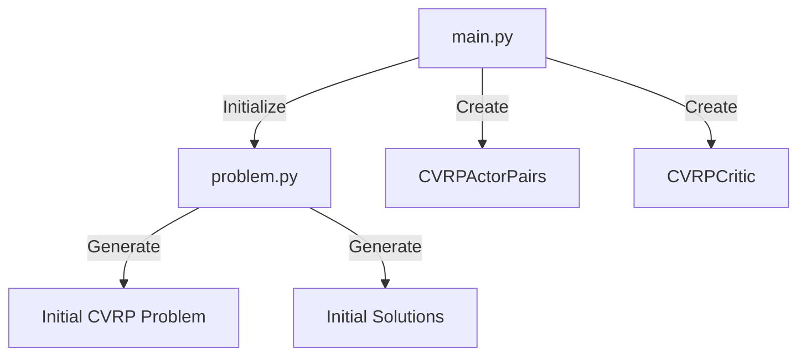
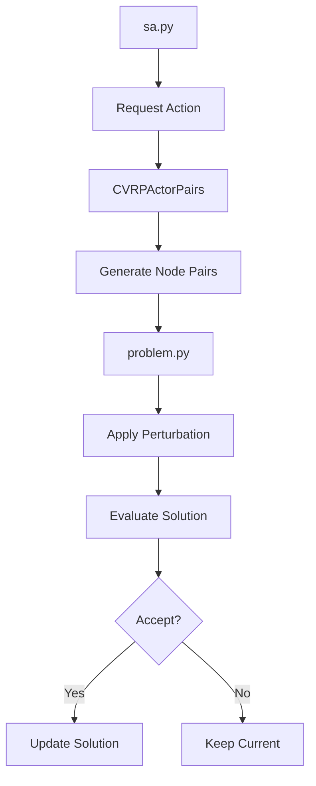
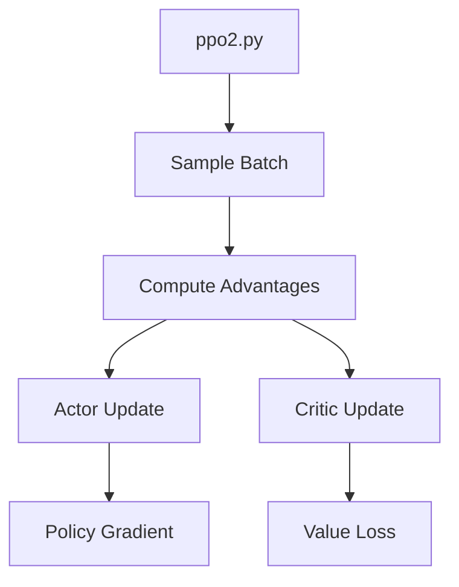

# NSA_CVRP_PPO: Neural Simulated Annealing for Capacitated Vehicle Routing with PPO

A reinforcement learning approach combining Proximal Policy Optimization (PPO) with Simulated Annealing (SA) to solve Capacitated Vehicle Routing Problems (CVRP).

## 📌 Key Features

- **Hybrid RL-Optimization**: Combines PPO with Simulated Annealing for improved exploration
- **Parallel Processing**: Handles batches of CVRP instances simultaneously
- **Flexible Heuristics**: Supports swap, 2-opt, and mixed modification operators
- **Adaptive Learning**: Implements temperature scheduling and adaptive clipping
- **Comprehensive Logging**: Integrated with Weights & Biases (wandb) for experiment tracking

## 🏗️ Project Structure
```text
NSA_CVRP_PPO/
├── README.md # Project documentation
├── requirements.txt # Python dependencies
├── launch_HP_sweep # Hyperparameter sweep launcher
├── res/ # Results directory
├── src/ # Main source code
│ ├── main.py # Training script
│ ├── HP.py # Hyperparameter management
│ ├── utils.py # Utility functions
│ ├── HP.yaml # Hyperparameter configuration
│ ├── HP_sweep.yaml # Hyperparameter sweep config
│ ├── Logger.py # WandB logging utilities
│ ├── model.py # Neural network architectures
│ ├── or_tools.py # OR-Tools integration
│ ├── pop.py/ppo2.py # PPO implementations
│ ├── problem.py # CVRP environment
│ ├── replay.py # Experience replay buffer
│ ├── sa.py # Simulated Annealing
│ ├── scheduler.py # Temperature schedulers
├── bdd/ # CVRP benchmark datasets
├── wandb/ # Model checkpoints
├── Scripts/ # Evaluation and visualization scripts
```

## 🛠️ Installation

1. Clone the repository:
```bash
git clone https://github.com/JAndretti/Neural_Simulated_Annealing_CVRP_PPO.git
cd Neural_Simulated_Annealing_CVRP_PPO
```
2. Install dependencies:
```bash
pip install -r requirements.txt
```
3. Set up Weights & Biases:
- Create an accout (free if you use academic email for personnal research)
- Create a file src/key.txt and write your personnal key access from wandb

## 🚀 Usage

### Training
```bash
python src/main.py
```
Or if you want to sweep hyperparameter

```bash
python launch_HP_sweep.py
```

### Key Configuration

Modify `src/HP.yaml` for basic settings or `src/HP_sweep.yaml` for sweep configurations.

## 🧠 Core Components

### 1. CVRP Environment (problem.py)

- Implements the Capacitated Vehicle Routing Problem
- Handles solution representation and cost calculation
- Provides greedy initialization and solution modification heuristics
- Manages vehicle capacity constraints and route validations
### 2. Neural Architectures (model.py)

- *CVRPActor*: Policy network proposing solution modifications
  - Takes current solution state as input
  - Outputs probabilities for node pairs/positions to modify
- *CVRPCritic*: Value network estimating state values
  - Evaluates quality of current solutions
  - Provides baseline for advantage calculation
### 3. Simulated Annealing (sa.py)

- Combines traditional SA with neural guidance
- Implements Metropolis acceptance criterion
- Tracks optimization statistics and experience collection
### 4. PPO Implementation (ppo2.py)

- Proximal Policy Optimization with:
  - Generalized Advantage Estimation
  - Gradient penalty
  - Adaptive clipping
  - Experience replay
- Handles policy updates and value function optimization

## 🔄 Component Interaction Workflow 

### 1. Initialization Phase

```mermaid
graph TD
    A[main.py] -->|Initialize| B[problem.py]
    A -->|Create| C[CVRPActorPairs]
    A -->|Create| D[CVRPCritic]
    B -->|Generate| E[Initial CVRP Problem]
    B -->|Generate| F[Initial Solutions]
```

#### Process:

- main.py initializes the CVRP environment via problem.py
- Creates CVRPActorPairs (policy) and CVRPCritic (value) models
- Generates initial problems and solutions via :

```python
problem = CVRP(cfg["PROBLEM_DIM"], cfg["N_PROBLEMS"], cfg["MAX_LOAD"])
init_x = problem.generate_init_x()  # greedy solution
```
### 2. Simulated Annealing Phase

```mermaid
graph TD
    A[sa.py] --> B[Request Action]
    B --> C[CVRPActorPairs]
    C --> D[Generate Node Pairs]
    D --> E[problem.py]
    E --> F[Apply Perturbation]
    F --> G[Evaluate Solution]
    G --> H{Accept?}
    H -->|Yes| I[Update Solution]
    H -->|No| J[Keep Current]
```

#### Detailed Steps:

1. Action Generation:
- sa.py calls actor.sample() (in model.py)
- The model generates pairs of nodes to be disturbed:
```python
action, log_prob, mask = actor.sample(state, greedy=False)
# Format: [batch_size, 3] where [:,0:2] = indices, [:,2] = heuristics
```
Solution Perturbation:
problem.py applies the perturbation via :
```python
new_solution = problem.update(current_solution, action)
```
Use either :
- `swap()` (exchanges two nodes)
- `two_opt()` (inverts a segment)
- Or one of them if `mixed_heuristic=True`.
3. Metropolis Criterion:
- Calculate Δcost = current_cost - new_cost
- Probability of acceptance :
```python
p_accept = min(1, exp(Δcost / temp))
```
4. Experience Recording:
- Stores transition in ReplayBuffer :
```python
replay.push(state, action, next_state, reward, log_prob, mask)
```

### 3. PPO Learning Phase


```mermaid
graph TD
    A[ppo2.py] --> B[Sample Batch]
    B --> C[Compute Advantages]
    C --> D[Actor Update]
    C --> E[Critic Update]
    D --> F[Policy Gradient]
    E --> G[Value Loss]
```

#### Key Processes:

1. Batch Sampling:
- Sample ReplayBuffer transitions
- Data structure :
```python
Transition = namedtuple('Transition', 
               ['state','action','next_state',
                'reward','log_prob','mask'])
```
2. Advantage Calculation (GAE):
```python
delta = rewards + γ * V(s') - V(s)
advantages = ∑ (γλ)^t * delta
```
3. Policy Update:
Calculate the probability ratio :
```python
ratio = exp(new_log_prob - old_log_prob)
```
Loss with PPO clipping :
```python
loss = -min(ratio * A, clip(ratio,1-ε,1+ε)*A)
```
4. Critic Update:
```python
value_loss = 0.5 * (V(s) - R)^2 + gradient_penalty
```
### Testing

The `Scripts/` folder contains utility scripts for evaluation and visualization:

- **eval.py**: Script to evaluate trained models on generated instances (fixed seed + fast).
- **eval_on_bdd.py**: Script to evaluate trained models on benchmark datasets (slow).
- **generate_plot.py**: Plots for comparing model with OR_TOOLS and baseline.
- **bdd.py**: Exports bdd in a structured format for further analysis/testing.

These scripts are designed to streamline post-training analysis and provide insights into model performance.

## 📊 Monitoring

The project integrates with Weights & Biases to track:

- Training losses
- Solution quality improvements
- Gradient statistics
- Temperature scheduling
- Model checkpoints


## 📚 References

Schulman et al. "Proximal Policy Optimization Algorithms" (2017)  
Alvaro H.C. Correia et al. "Neural Simulated Annealing" (2023)